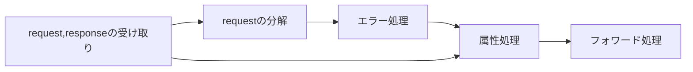

# MVC cording解説


## Good.java(Goods用のDTOクラス)

全体像は以下の感じ

```java
package chap1.dbbean;
import java.io.Serializable;

/**
 * 商品テーブル用DTOクラス
 * 
 */
public class Goods implements Serializable {
	private int id; // 商品ID
	private String name; // 商品名
	private int price; // 単価

	public int getId() {
		return id;
	}

	public void setId(int id) {
		this.id = id;
	}

	public String getName() {
		return name;
	}

	public void setName(String name) {
		this.name = name;
	}

	public int getPrice() {
		return price;
	}

	public void setPrice(int price) {
		this.price = price;
	}
}
```

### メンバ変数

```java
public class Goods implements Serializable {
	private int id; // 商品ID
	private String name; // 商品名
	private int price; // 単価
```

メンバ変数は以上のコードのようになっていて、*id*,*name*,*price*という３つがありそれぞれ`private`という修飾子がついている。

> ここで修飾子をおさらいすると、こんな感じ
>
> | アクセス修飾子       | 同一クラス | 同一パッケージ | サブクラス | すべて |
> | -------------------- | ---------- | -------------- | ---------- | ------ |
> | public               | 〇         | 〇             | 〇         | 〇     |
> | protected            | 〇         | 〇             | 〇         | ×      |
> | 指定なし(デフォルト) | 〇         | 〇             | ×          | ×      |
> | private              | 〇         | ×              | ×          | ×      |
>
> {: .prompt-tip }

なので、今回の3つ変数は同一クラス`class Goods`でしか変数の値を変えたり、用いたりすることができない。

**それって不便過ぎない？？？**、だってgoodsクラスは**Beans**なんだから情報をまとめているよね？確かに他からは見られたくはないけどもさ...　ということで、他のclassからアクセスして値を変えたり、用いたりする用の`メゾット`を`public`で作っちゃいます。

それが以下の部分

```java
　　public int getId() {
		return id;
	}

	public void setId(int id) {
		this.id = id;
	}
```

長いのでIdのgetterの`getId()`とsetterの`setId()`を取り出してきました。publicにしてるのでこのメゾットは**どこからでもアクセスできる!!**

これって、getter・setterを使うことで直接メンバ変数にアクセスが禁止されたけども**間接的に**値を**変更・参照**できるよね！！

なので、

> Beansは直接**値**を編集することはできないがgetterとsetterを使って値を**間接的に**変更することができる！！
>
> →　他人のプログラムから直接改変する恐れが小さい(一応ないことはないよ...)
>
> {: .prompt-info }

---

## Goods DAO

はいでました、問題児、ちょっとコードが長すぎるので全文はAppendixに貼っておきます。

### ArrayList・List

```java
package chap1.dbbean;

import java.sql.Connection;
import java.sql.DriverManager;
import java.sql.PreparedStatement;
import java.sql.ResultSet;
import java.sql.SQLException;
import java.util.ArrayList;

/**
 * 商品テーブル用DAOクラス
 */
public class GoodsDAO {

	// 商品テーブルから抽出した商品リスト
	private ArrayList<Goods> list = new ArrayList<Goods>();


}
```

上のコードは**SQL**で必要となる部分です。

その前に`ArrayList`や`List`とは何か...?

`List`は箱を先に用意してから要素を詰めたもののイメージ（全部埋める必要はなく一部でもいい）

List → [　　   | 　　   |　　　 |  　　 ]

List → [要素A | 要素B | 要素C | 要素D]

でこれらの入っている要素は**すべて同じ型 or クラスでないといけない**という制約がある。

じゃあ、`ArrayList`は？

> `List`インタフェースのサイズ変更可能な配列の実装です。リストのオプションの操作をすべて実装し、`null`を含むすべての要素を許容します。このクラスは、`List`インタフェースを実装するほか、リストを格納するために内部的に使われる配列のサイズを操作するメソッドを提供します。(このクラスは、同期化されないことを除いて`Vector`とほぼ同等。)

> 長々とありますが、多分、hashを用いた2分木な気がしますねぇ...(ガチで知らんけど)
>
> {: .prompt-tips }

なにであれ重要な部分は**`List`インタフェースのサイズ変更可能な配列の実装です**の一文に限りますね。

配列はさっきも書いたけど、通常は固定サイズを確保します。(alloc等で取るためヒープ領域での確保になるしJavaの設計思想と反する)

ただ、こいつは配列をいくつも伸ばしていいという**意味わからん**ことができ、あとは配列と同じです。やったね！！

------

### SQL文

```java
	// 商品テーブルから全件参照するSQL
	private static final String SQL_SELECTALL_GOODS = "select * from goods";

	// 商品テーブルから商品名のキーワード検索するSQL
	private static final String SQL_SELECT_BY_NAME_GOODS = "select * from goods where name like ? ORDER BY name";

	// 商品テーブルから商品IDで検索するSQL
	private static final String SQL_SELECT_BY_ID_GOODS = "select * from goods where id = ?";

	// 商品テーブルに商品を追加するSQL
	private static final String SQL_INSERT_GOODS = "insert into goods values(?,?,?)";

	// 商品テーブルの商品を更新するSQL
	private static final String SQL_UPDATE_GOODS = "update goods set name = ?,price = ? where id = ?";

	// 商品テーブルの商品を削除するSQL
	private static final String SQL_DELETE_GOODS = "delete from  goods where id = ?";

	/**
	 * コネクションオブジェクトを取得する
	 * @return コネクション
	 * @throws SQLException
	 * @throws ClassNotFoundException
	 */
	public Connection getConnection() throws SQLException, ClassNotFoundException {
		Connection conn = null;

		Class.forName("com.mysql.cj.jdbc.Driver");
		conn = DriverManager.getConnection(
				"jdbc:mysql://localhost:3306/dbmvc?characterEncoding=utf8&useSSL=false&serverTimezone=GMT%2B9:00&rewriteBatchedStatements=true&allowPublicKeyRetrieval=true",
				"root", "mysql");

		return conn;
	}
}
```

さて、SQL文自体は解説しませんが、`SQL_UPDATE_GOODS`とか`SQL_SELECT_BY_NAME_GOODS`って感じで先に定数な文字列に入れっちゃってるんですよね。

なんでかというと、SQLは文法がほぼ似ているからに尽きます。はい

詳しく言うと、変える部分は`id = ?`の?の部分であったりといった限定されているからなんですよね。これ以上はSQL頑張ってください。

というわけで、それぞれ`Insert`,`Delete`,`update`とかの構文を用意しておきます。

でも、つなぐ先はどこやねんってなりますよね。

これが`public Connection getConnection() throws SQLException, ClassNotFoundException`っていうメゾットです。

半分解説するのもあれですが

- `Class.forName("com.mysql.cj.jdbc.Driver");`はSQLに使う用のJDBCの指定
- `DriverManager.getConnection()`はコネクション先の指定ですね (今回書かれている()の中はもう読めるよね)
- `return conn`でコネクションを返すって感じですね

コネクション周りはネットワークの話になるので割愛

### DAOのメゾット

以下が商品テーブルから全件参照するメゾットです。

#### ArrayList<Goods> selectAll()

```java
	/**
	 * 商品テーブルから全件参照する
	 * @return　商品リスト（全件）
	 */
	public ArrayList<Goods> selectAll() {
		Connection conn = null;
		PreparedStatement pstmt = null;
		ResultSet rs = null;
		try {
			conn = getConnection();
			pstmt = conn.prepareStatement(SQL_SELECTALL_GOODS);
			rs = pstmt.executeQuery();
			readResultSet(rs);
			return list;
		} catch (SQLException | ClassNotFoundException e) {
			e.printStackTrace();
			return null;
		} finally {
			try {
				if (rs != null) {
					rs.close();
				}
			} catch (SQLException e) {
				e.printStackTrace();
			}
			try {
				if (pstmt != null) {
					pstmt.close();
				}
			} catch (SQLException e) {
				e.printStackTrace();
			}

			try {
				if (conn != null) {
					conn.close();
				}
			} catch (SQLException e) {
				e.printStackTrace();
			}
		}
	}
```


順に見ていく前に必要な部分だけ抜き出します。エラーに関しては一旦そんなもんでいいです。興味がある人は声を変えてもらえれば...

```java
	public ArrayList<Goods> selectAll() {
		Connection conn = null;
		PreparedStatement pstmt = null;
		ResultSet rs = null;
		try {
			conn = getConnection();
			pstmt = conn.prepareStatement(SQL_SELECTALL_GOODS);
			rs = pstmt.executeQuery();
			readResultSet(rs);
			return list;
		}
```

実はこれだけです。。

定義さえも抜いてしまえば5行ですねおーまいがー。。。

- `conn = getConnection();`はさっき説明したDBへの接続準備を勝手にしてくれるもの
- `pstmt = conn.prepareStatement(SQL_SELECTALL_GOODS);`これもさっき説明した基礎SQL文の構築
- `rs = pstmt.executeQuery();`はSQLクエリの発行でこれをすることでSQLにJavaが「このクエリ実行してくんね？」って行ってくれます。あー便利
- `readResultSet(rs);`クエリで帰ってきたものをパースするメゾットです、後で説明します。

てな感じですね。

順に書くと

DBへの接続準備→基礎SQL文の構築→SQLクエリの発行→クエリの戻り値をパース→パースをリストにして`return`

の４つになりますね。

#### private void readResultSet(rs);とは？

これはデフォルトで設定されているメゾットではなくてGoodsDAOで用いられているものです。

```java
	/**
	 * 商品テーブルの抽出結果を商品リストに格納する
	 * @param rs
	 * @throws SQLException
	 */
	private void readResultSet(ResultSet rs) throws SQLException {
		list.clear();
		while (rs.next()) {
			Goods goods = new Goods();
			goods.setId(rs.getInt("id"));
			goods.setName(rs.getString("name"));
			goods.setPrice(rs.getInt("price"));
			list.add(goods);
		}
	}
```

これを見ていくと、`rs`ってなんやねんってなりますが、中に入っているものはこの感じになってます。

初めに`rs.next()`ってすると**1→**の部分に行きます。そこで`getInt`や`getString`をすることでその行にある値をとってこれます。例えば、`getInt("id")`だと、Id0の値が帰ってきます。

更に`rs.next()`ってすると今度は**2→**の部分に行きます。同様に`getInt`や`getString`をすることでその行にある値をとってこれます。

|         |  id  | name  | price  |
| :-----: | :--: | :---: | :----: |
| 1→re[0] | id0  | name0 | price0 |
| 2→re[1] | id1  | name1 | price1 |

ってな感じでしているので`rs`の中身は**配列**って考えてもいいかもですね。

`rs.next()`が`False`ってことは**rsに次の値がない!!**になるのでここでloopをやめたいという思惑もあって、`rs.next()`をwhile文に入れています。

さて、この部分のコードをまとめると、

`rs.next()`が`True`の間(次の値が存在する時)だけ`getInt`や`getString`をすることでその行の変数を取得しそれをまとめてgoodsにsetterを使ってセットしてそれをlistに追加する。

ってことになりますね。

### ほかのメゾット

ほかのメゾットも同じようなことをしているので各自で確認してください。


## Servlet

### GoodsSelectServlet.java

これをモチーフにします。

```java
package chap1.servlet;

import java.io.IOException;
import java.util.ArrayList;

import javax.servlet.RequestDispatcher;
import javax.servlet.ServletContext;
import javax.servlet.ServletException;
import javax.servlet.annotation.WebServlet;
import javax.servlet.http.HttpServlet;
import javax.servlet.http.HttpServletRequest;
import javax.servlet.http.HttpServletResponse;

import chap1.dbbean.Goods;
import chap1.dbbean.GoodsDAO;

/**
 * 商品キーワード検索用サーブレット
 *
 */
@WebServlet("/GoodsSelectServlet")
public class GoodsSelectServlet extends HttpServlet {
	private static final long serialVersionUID = 1L;

	protected void doPost(HttpServletRequest request, HttpServletResponse response)
			throws ServletException, IOException {

		String url = "/jsp/chap1/goodsSelect.jsp"; // フォワード先のURL
		GoodsDAO dao = null;
		ArrayList<Goods> list = null;

		// 入力パラメータをデコードする文字コード指定
		request.setCharacterEncoding("UTF-8");

		// リクエストパラメータの取得
		String keyword = request.getParameter("keyword");

		// キーワードが未入力だったらエラー
		if (keyword.isEmpty()) {
			request.setAttribute("outMsg", "キーワードが未入力です");
			url = "/jsp/chap1/goodsErr.jsp";
		} else {
			dao = new GoodsDAO();
			list = dao.selectByName(keyword);

			if (list == null) { // リストがnullなら検索エラー
				request.setAttribute("outMsg", "検索エラーです");
				url = "/jsp/chap1/goodsErr.jsp";
			} else if (list.size() < 1) { // リストサイズが1未満なら、検索結果0件
				request.setAttribute("outMsg", "検索結果0件です");
				url = "/jsp/chap1/goodsErr.jsp";
			} else { // 検索結果あり（成功）
				request.setAttribute("list", list);

			}
		}

		// コンテキストオブジェクトの参照
		ServletContext sc = getServletContext();

		// リクエストのフォワード
		RequestDispatcher rd = sc.getRequestDispatcher(url);
		rd.forward(request, response);
	}
}
```

これも必要なところだけ抜き出すと、

```java
	protected void doPost(HttpServletRequest request, HttpServletResponse response)
			throws ServletException, IOException {

		String url = "/jsp/chap1/goodsSelect.jsp"; // フォワード先のURL
		GoodsDAO dao = null;
		ArrayList<Goods> list = null;

		// 入力パラメータをデコードする文字コード指定
		request.setCharacterEncoding("UTF-8");

		// リクエストパラメータの取得
		String keyword = request.getParameter("keyword");

		// キーワードが未入力だったらエラー
		if (keyword.isEmpty()) {
			request.setAttribute("outMsg", "キーワードが未入力です");
			url = "/jsp/chap1/goodsErr.jsp";
		} else {
			dao = new GoodsDAO();
			list = dao.selectByName(keyword);

			if (list == null) { // リストがnullなら検索エラー
				request.setAttribute("outMsg", "検索エラーです");
				url = "/jsp/chap1/goodsErr.jsp";
			} else if (list.size() < 1) { // リストサイズが1未満なら、検索結果0件
				request.setAttribute("outMsg", "検索結果0件です");
				url = "/jsp/chap1/goodsErr.jsp";
			} else { // 検索結果あり（成功）
				request.setAttribute("list", list);

			}
		}

		// コンテキストオブジェクトの参照
		ServletContext sc = getServletContext();

		// リクエストのフォワード
		RequestDispatcher rd = sc.getRequestDispatcher(url);
		rd.forward(request, response);
	}

```

#### 定義とrequestの分解

更に分解して、

```java
		// 入力パラメータをデコードする文字コード指定
		request.setCharacterEncoding("UTF-8");

		// リクエストパラメータの取得
		String keyword = request.getParameter("keyword");

```

このコードで、`request`によって送られてきたデータを分解してJavaの変数に代入しています。

#### エラー処理

次に

```java
// キーワードが未入力だったらエラー
		if (keyword.isEmpty()) {
			request.setAttribute("outMsg", "キーワードが未入力です");
			url = "/jsp/chap1/goodsErr.jsp";
		} else {
			dao = new GoodsDAO();
			list = dao.selectByName(keyword);

			if (list == null) { // リストがnullなら検索エラー
				request.setAttribute("outMsg", "検索エラーです");
				url = "/jsp/chap1/goodsErr.jsp";
			} else if (list.size() < 1) { // リストサイズが1未満なら、検索結果0件
				request.setAttribute("outMsg", "検索結果0件です");
				url = "/jsp/chap1/goodsErr.jsp";
			} else { // 検索結果あり（成功）
				request.setAttribute("list", list);

			}
		}

```

ここでエラー処理(未入力・検索結果なし)を行って、返答する`メッセージ`と`jsp`を決めます。

#### フォワード処理

最後に

```java
		// コンテキストオブジェクトの参照
		ServletContext sc = getServletContext();

		// リクエストのフォワード
		RequestDispatcher rd = sc.getRequestDispatcher(url);
		rd.forward(request, response);
```

って感じで`ServletContext`で大きく箱を作り、`sc.getRequestDispatcher(url)`でフォワード先の指定し、`rd.forward(request, response);`で実際にフォワードします。

#### まとめ



処理の流れを見るとこんな感じになるはずです。


# Appendix

## Appendix A

```java
package chap1.dbbean;

import java.sql.Connection;
import java.sql.DriverManager;
import java.sql.PreparedStatement;
import java.sql.ResultSet;
import java.sql.SQLException;
import java.util.ArrayList;

/**
 * 商品テーブル用DAOクラス
 */
public class GoodsDAO {

	// 商品テーブルから抽出した商品リスト
	private ArrayList<Goods> list = new ArrayList<Goods>();

	// 商品テーブルから全件参照するSQL
	private static final String SQL_SELECTALL_GOODS = "select * from goods";

	// 商品テーブルから商品名のキーワード検索するSQL
	private static final String SQL_SELECT_BY_NAME_GOODS = "select * from goods where name like ? ORDER BY name";

	// 商品テーブルから商品IDで検索するSQL
	private static final String SQL_SELECT_BY_ID_GOODS = "select * from goods where id = ?";

	// 商品テーブルに商品を追加するSQL
	private static final String SQL_INSERT_GOODS = "insert into goods values(?,?,?)";

	// 商品テーブルの商品を更新するSQL
	private static final String SQL_UPDATE_GOODS = "update goods set name = ?,price = ? where id = ?";

	// 商品テーブルの商品を削除するSQL
	private static final String SQL_DELETE_GOODS = "delete from  goods where id = ?";

	/**
	 * コネクションオブジェクトを取得する
	 * @return コネクション
	 * @throws SQLException
	 * @throws ClassNotFoundException
	 */
	public Connection getConnection() throws SQLException, ClassNotFoundException {
		Connection conn = null;

		Class.forName("com.mysql.cj.jdbc.Driver");
		conn = DriverManager.getConnection(
				"jdbc:mysql://localhost:3306/dbmvc?characterEncoding=utf8&useSSL=false&serverTimezone=GMT%2B9:00&rewriteBatchedStatements=true&allowPublicKeyRetrieval=true",
				"root", "mysql");

		return conn;
	}

	/**
	 * 商品テーブルから全件参照する
	 * @return　商品リスト（全件）
	 */
	public ArrayList<Goods> selectAll() {
		Connection conn = null;
		PreparedStatement pstmt = null;
		ResultSet rs = null;
		try {
			conn = getConnection();
			pstmt = conn.prepareStatement(SQL_SELECTALL_GOODS);
			rs = pstmt.executeQuery();
			readResultSet(rs);
			return list;
		} catch (SQLException | ClassNotFoundException e) {
			e.printStackTrace();
			return null;
		} finally {
			try {
				if (rs != null) {
					rs.close();
				}
			} catch (SQLException e) {
				e.printStackTrace();
			}
			try {
				if (pstmt != null) {
					pstmt.close();
				}
			} catch (SQLException e) {
				e.printStackTrace();
			}

			try {
				if (conn != null) {
					conn.close();
				}
			} catch (SQLException e) {
				e.printStackTrace();
			}
		}
	}

	/**
	 * 商品テーブルからキーワード検索した結果を返す
	 * @param keyword キーワード
	 * @return 商品リスト（キーワード検索）
	 */
	public ArrayList<Goods> selectByName(String keyword) {
		Connection conn = null;
		PreparedStatement pstmt = null;
		ResultSet rs = null;

		//キーワードが未入力の場合、nullを返す
		if (keyword.isEmpty()) {
			return null;
		}
		try {
			conn = getConnection();
			pstmt = conn.prepareStatement(SQL_SELECT_BY_NAME_GOODS);
			pstmt.setString(1, "%" + keyword + "%");
			rs = pstmt.executeQuery();
			readResultSet(rs);
			return list;
		} catch (SQLException | ClassNotFoundException e) {
			e.printStackTrace();
			return null;
		} finally {
			try {
				if (rs != null) {
					rs.close();
				}
			} catch (SQLException e) {
				e.printStackTrace();
			}
			try {
				if (pstmt != null) {
					pstmt.close();
				}
			} catch (SQLException e) {
				e.printStackTrace();
			}

			try {
				if (conn != null) {
					conn.close();
				}
			} catch (SQLException e) {
				e.printStackTrace();
			}
		}
	}

	/**
	 * 商品テーブルから商品IDで検索した結果を返す
	 * @param ID
	 * @return 商品（ID検索）
	 */
	public Goods selectById(int id) {
		Goods goods = null;
		Connection conn = null;
		PreparedStatement pstmt = null;
		ResultSet rs = null;

		try {
			conn = getConnection();
			pstmt = conn.prepareStatement(SQL_SELECT_BY_ID_GOODS);
			pstmt.setInt(1, id);
			rs = pstmt.executeQuery();
			readResultSet(rs);

			//商品IDの検索結果があれば、商品オブジェクトを取得する
			if (list.size() > 0) {
				goods = list.get(0);
			}
			return goods;
		} catch (SQLException | ClassNotFoundException e) {
			e.printStackTrace();
			return null;
		} finally {
			try {
				if (rs != null) {
					rs.close();
				}
			} catch (SQLException e) {
				e.printStackTrace();
			}
			try {
				if (pstmt != null) {
					pstmt.close();
				}
			} catch (SQLException e) {
				e.printStackTrace();
			}

			try {
				if (conn != null) {
					conn.close();
				}
			} catch (SQLException e) {
				e.printStackTrace();
			}
		}
	}

	/**
	 * 商品テーブルに商品を追加する
	 * @param Goods
	 * @return 追加件数
	 */
	public int insert(Goods goods) {
		int count = 0;
		Connection conn = null;
		PreparedStatement pstmt = null;

		try {
			conn = getConnection();
			pstmt = conn.prepareStatement(SQL_INSERT_GOODS);
			pstmt.setInt(1, goods.getId());
			pstmt.setString(2, goods.getName());
			pstmt.setInt(3, goods.getPrice());
			count = pstmt.executeUpdate();
			return count;
		} catch (SQLException | ClassNotFoundException e) {
			e.printStackTrace();
			return count;
		} finally {
			try {
				if (pstmt != null) {
					pstmt.close();
				}
			} catch (SQLException e) {
				e.printStackTrace();
			}

			try {
				if (conn != null) {
					conn.close();
				}
			} catch (SQLException e) {
				e.printStackTrace();
			}
		}
	}

	/**
	 * 商品テーブルの商品を更新する
	 * @param Goods
	 * @return 更新件数
	 */
	public int update(Goods goods) {
		int count = 0;
		Connection conn = null;
		PreparedStatement pstmt = null;

		try {
			conn = getConnection();
			pstmt = conn.prepareStatement(SQL_UPDATE_GOODS);
			pstmt.setString(1, goods.getName());
			pstmt.setInt(2, goods.getPrice());
			pstmt.setInt(3, goods.getId());
			count = pstmt.executeUpdate();
			return count;
		} catch (SQLException | ClassNotFoundException e) {
			e.printStackTrace();
			return count;
		} finally {
			try {
				if (pstmt != null) {
					pstmt.close();
				}
			} catch (SQLException e) {
				e.printStackTrace();
			}

			try {
				if (conn != null) {
					conn.close();
				}
			} catch (SQLException e) {
				e.printStackTrace();
			}
		}
	}

	/**
	 * 商品テーブルの商品を削除する
	 * @param Goods
	 * @return 削除件数
	 */
	public int delete(Goods goods) {
		int count = 0;
		Connection conn = null;
		PreparedStatement pstmt = null;

		try {
			conn = getConnection();
			pstmt = conn.prepareStatement(SQL_DELETE_GOODS);
			pstmt.setInt(1, goods.getId());
			count = pstmt.executeUpdate();
			return count;
		} catch (SQLException | ClassNotFoundException e) {
			e.printStackTrace();
			return count;
		} finally {
			try {
				if (pstmt != null) {
					pstmt.close();
				}
			} catch (SQLException e) {
				e.printStackTrace();
			}

			try {
				if (conn != null) {
					conn.close();
				}
			} catch (SQLException e) {
				e.printStackTrace();
			}
		}
	}

	/**
	 * 商品テーブルの抽出結果を商品リストに格納する
	 * @param rs
	 * @throws SQLException
	 */
	private void readResultSet(ResultSet rs) throws SQLException {
		list.clear();
		while (rs.next()) {
			Goods goods = new Goods();
			goods.setId(rs.getInt("id"));
			goods.setName(rs.getString("name"));
			goods.setPrice(rs.getInt("price"));
			list.add(goods);
		}
	}
}
```
